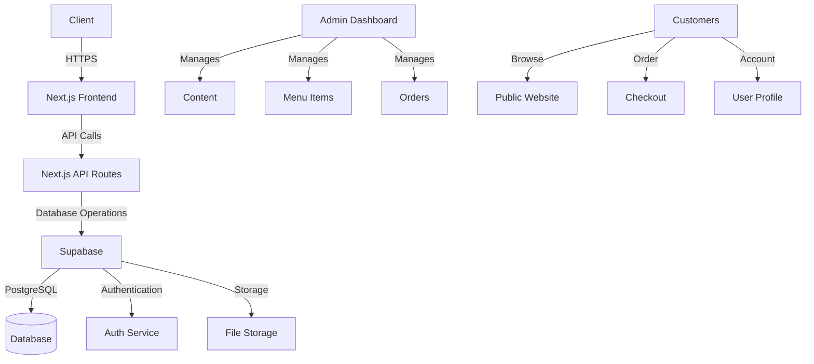

# System Architecture

## High-Level Architecture



## Folder Structure

```
├── app/                         # Next.js 13+ App Router
│   ├── (website)/               # Public website routes
│   │   └── [slug]/              # Dynamic page routes
│   ├── api/                     # API routes
│   ├── categories/              # Category management
│   ├── login/                   # Authentication
│   ├── orders/                  # Order management
│   ├── pages/                   # Page management
│   └── products/                # Product management
├── components/                  # Reusable UI components
│   ├── website/                 # Website-specific components
│   ├── ui/                      # Base UI components
│   └── ...
├── context/                    # React context providers
├── hooks/                      # Custom React hooks
├── lib/                        # Utility functions and configs
│   ├── client.ts               # Supabase client
│   ├── server.ts               # Server-side utilities
│   └── page-builder.ts         # Page builder types and utils
├── public/                     # Static assets
└── styles/                     # Global styles
```

## Data Flow

### 1. Page Rendering
1. User requests a page (`/menu`)
2. Next.js fetches page data from Supabase
3. Server renders the page with the appropriate layout and sections
4. Client-side hydration occurs
5. Interactive elements become functional

### 2. Content Editing
1. Admin accesses the page editor
2. Page data is loaded from Supabase
3. User makes changes using the visual editor
4. Changes are saved via API routes to Supabase
5. Changes are immediately reflected in the preview

### 3. Order Processing
1. Customer adds items to cart
2. Cart is stored in local storage/context
3. Checkout sends order to API route
4. API route processes payment and creates order in Supabase
5. Both customer and restaurant receive confirmation

## Supabase Integration

### Database Schema

#### Pages Table
```typescript
{
  id: string
  title: string
  slug: string
  description?: string
  status: 'draft' | 'published'
  sections: Section[]
  created_at: timestamp
  updated_at: timestamp
}
```

#### Products Table
```typescript
{
  id: string
  name: string
  description?: string
  price: number
  image_url?: string
  category_id: string
  is_available: boolean
  created_at: timestamp
  updated_at: timestamp
}
```

### Authentication Flow
1. User signs in with email/password or OAuth
2. Supabase Auth issues a JWT
3. JWT is stored in HTTP-only cookies
4. All API routes verify the JWT
5. Row-level security enforces data access rules

### Real-time Updates
- Order status changes
- Menu updates
- Table availability

## Page Builder Architecture

### Section Types
1. **Hero Section**
   - Full-width banner
   - Configurable background and CTA

2. **Text + Image**
   - Side-by-side or stacked layout
   - Rich text content

3. **Testimonials**
   - Customer reviews
   - Star ratings
   - Carousel or grid layout

4. **Product Grid**
   - Displays menu items
   - Filterable by category
   - Sortable and searchable

5. **Contact CTA**
   - Contact form
   - Business information
   - Map integration

6. **Accordion Sidebar**
   - Navigation menu
   - Collapsible categories
   - Smooth scrolling to sections

### Component Hierarchy
```
<Page>
  <Header />
  <PageContent>
    {sections.map(section => (
      <SectionRenderer 
        key={section.id} 
        section={section} 
      />
    ))}
  </PageContent>
  <Footer />
</Page>
```

## Performance Considerations

### Frontend
- Code splitting with dynamic imports
- Image optimization with Next/Image
- Lazy loading for below-the-fold content
- Memoization for expensive calculations

### Backend
- Database indexing for frequent queries
- Caching with Redis (if implemented)
- Optimized database queries
- Rate limiting for API routes

## Security

### Authentication & Authorization
- JWT-based authentication
- Role-based access control
- Secure password policies
- OAuth providers

### Data Protection
- Row-level security in Supabase
- Input validation
- CSRF protection
- XSS prevention
- Secure HTTP headers

### API Security
- Rate limiting
- Request validation
- CORS configuration
- Error handling without leaking sensitive info

---

## Incident Auth Supabase/Next.js (mai 2025)

- Problème : La session Supabase n'était pas reconnue côté serveur (middleware Next.js) car stockée uniquement dans le localStorage côté client.
- Impact : Boucle de redirection /login ↔ /, impossible d'accéder à l'app même connecté.
- Solution : Migration vers @supabase/auth-helpers-nextjs pour synchroniser la session dans les cookies (createPagesBrowserClient côté client, createMiddlewareClient côté middleware).
- Résultat : Auth robuste SSR/SPA, état client/serveur synchronisé, plus de bug de session ou de boucle login.
